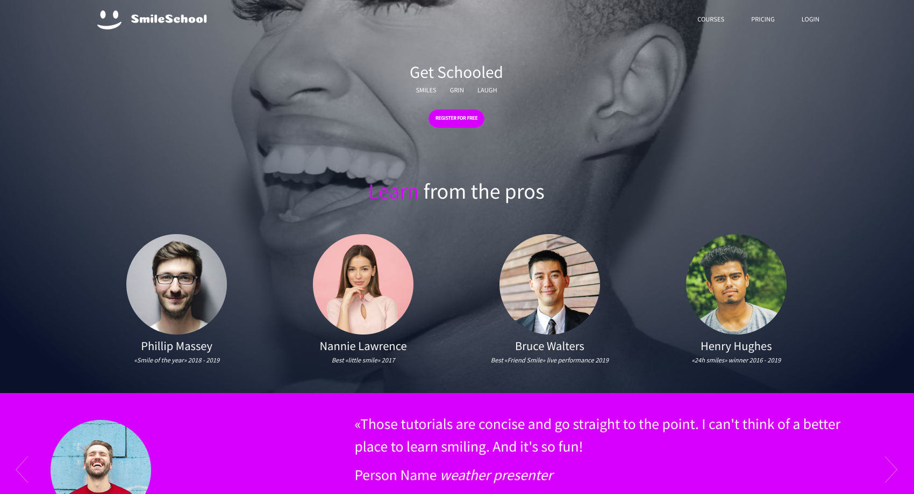
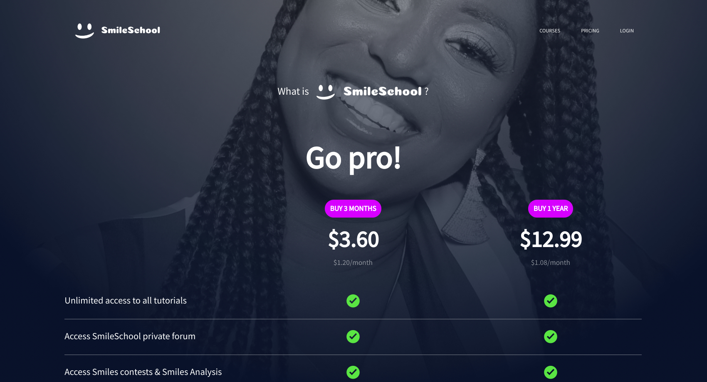
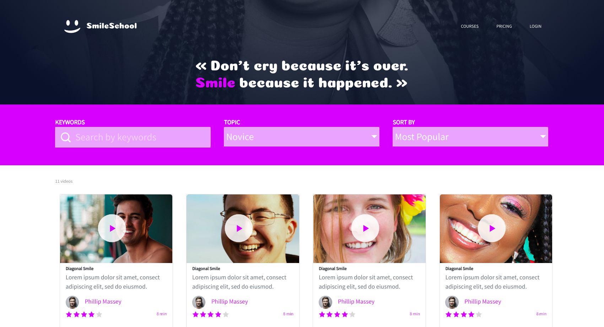

# holberton-smiling-school

## Overview

This proyect consist in developing a web page from scratch with the use of bootstrap.

## Homepage

## Pricing

## Courses

## Key topics

The following topics are covered in the
creation of the project:

- Bootstrap
  - Responsive design.
  - Cards.
  - Background images.
  - Carousels.
- HTML
  - Tags
  - Sections
- UX-UI
  - Figma

## Useful links

- Design details

  - Homepage
    https://intranet.hbtn.io/rltoken/RLej4Ua6W3EmDh7UCwGTzQ
  - Pricing
    https://intranet.hbtn.io/rltoken/RLej4Ua6W3EmDh7UCwGTzQ
  - Courses
    https://intranet.hbtn.io/rltoken/RLej4Ua6W3EmDh7UCwGTzQ

- Bootstrap documentation

https://getbootstrap.com/docs/5.2/getting-started/introduction/

- VS code libraries

  - Live server.
  - HTML CSS Support.
  - HTML Snippets.
